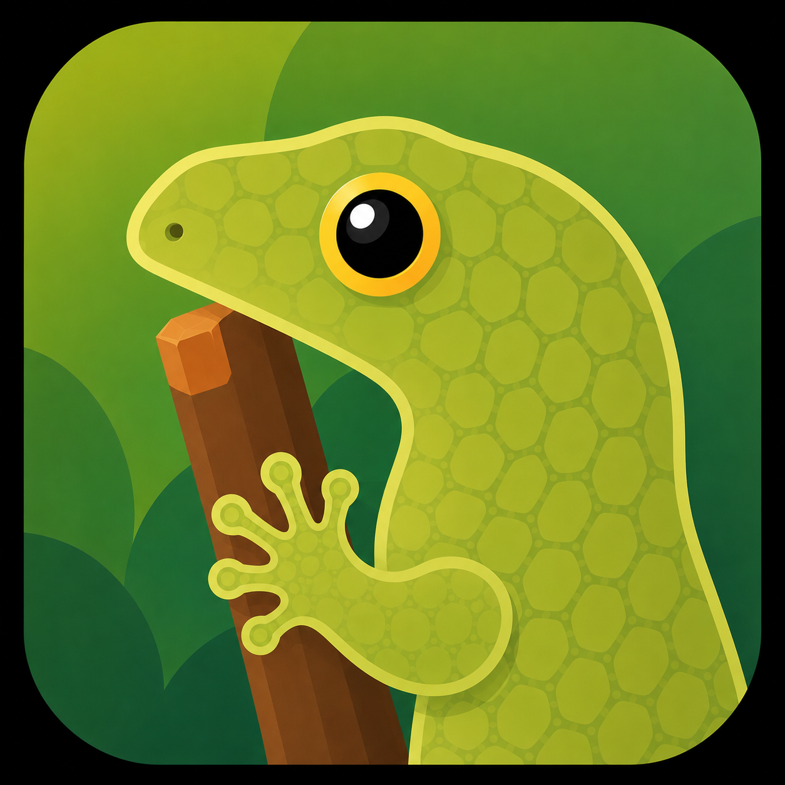

# Gecko

Gecko is an XMPP messaging app for iOS, built with SwiftUI on top of
[Dino](https://dino.im)'s messaging core.
It supports OMEMO encryption, group chats, file transfers, push notifications and more.

Gecko is a fork of Dino — the Vala/GTK XMPP client for Linux. GTK doesn't run on
iOS, so this tree keeps Dino's non-UI core (the Vala/GLib service stack:
`libdino`, `xmpp-vala`, `qlite`, `crypto-vala`, and the OMEMO + HTTP-upload
plugins), cross-compiles it as static libraries, and puts a native SwiftUI front
end on top through a small C/Vala bridge. The desktop GTK UI has been removed;
**this tree is iOS-only.**

Status
------
Working end to end against real servers:

- Login over SCRAM/STARTTLS, roster and bookmark sync, contact management
- One-to-one and group chats (MUC), with per-sender avatars and nicks
- **OMEMO** encryption (statically linked libomemo-c), with a stable device identity
- File transfers over HTTP upload, OMEMO-encrypted, with inline image previews
- Reactions (XEP-0444), corrections (XEP-0308), replies (XEP-0461),
  read markers (XEP-0333), typing notifications (XEP-0085)
- **Push notifications** — XEP-0357 through the bundled push proxy to APNs,
  with a Notification Service Extension that decrypts and filters on-device

Not implemented: voice/video calls (`plugin-rtp`/`plugin-ice` need GStreamer's
iOS binaries), OpenPGP, and ICU-based JID stringprep (a casefold fallback is
used instead).

There is no public release yet; builds are distributed via TestFlight and
sideloading.

Build
-----
Requires macOS with Xcode, and iOS 26 or later on the target device.

    ios/build-deps.sh sim-arm64        # dependency stack, ~15 min, downloads sources
    ios/build-core.sh sim-arm64        # Dino core + plugins + the bridge
    ios/app/build-app.sh run           # build and launch in the Simulator

Use `device-arm64` in place of `sim-arm64` to build for a physical device. Once
the static core prefix exists under `ios/prefix/<target>`, you can also open
`Gecko.xcodeproj` in Xcode and build the shared `Gecko` scheme.

Unit tests for the pure Swift helpers run on the host, without a Simulator:

    cd ios/app/GeckoKit && swift test

Resources
---------
- [`ios/PORTING.md`](ios/PORTING.md) — the port bible: cross-compile, bridge
  design, OMEMO, push, NSE phases, and the changes made to the upstream Vala tree.
- [`AGENTS.md`](AGENTS.md) — orientation for working in this repository.
- [`ios/PRIVACY.md`](ios/PRIVACY.md), [`ios/app/TESTFLIGHT.md`](ios/app/TESTFLIGHT.md) — privacy and release notes.
- Upstream: the [Dino website](https://dino.im), its
  [wiki](https://github.com/dino/dino/wiki), and the `chat@dino.im` XMPP channel.

License
-------
    Gecko - XMPP messaging app for iOS
    Copyright (C) 2026 Gecko contributors

    Based on Dino - XMPP messaging app using GTK/Vala
    Copyright (C) 2016-2025 Dino contributors

    This program is free software: you can redistribute it and/or modify
    it under the terms of the GNU General Public License as published by
    the Free Software Foundation, either version 3 of the License, or
    (at your option) any later version.

    This program is distributed in the hope that it will be useful,
    but WITHOUT ANY WARRANTY; without even the implied warranty of
    MERCHANTABILITY or FITNESS FOR A PARTICULAR PURPOSE.  See the
    GNU General Public License for more details.

    You should have received a copy of the GNU General Public License
    along with this program.  If not, see <http://www.gnu.org/licenses/>.
